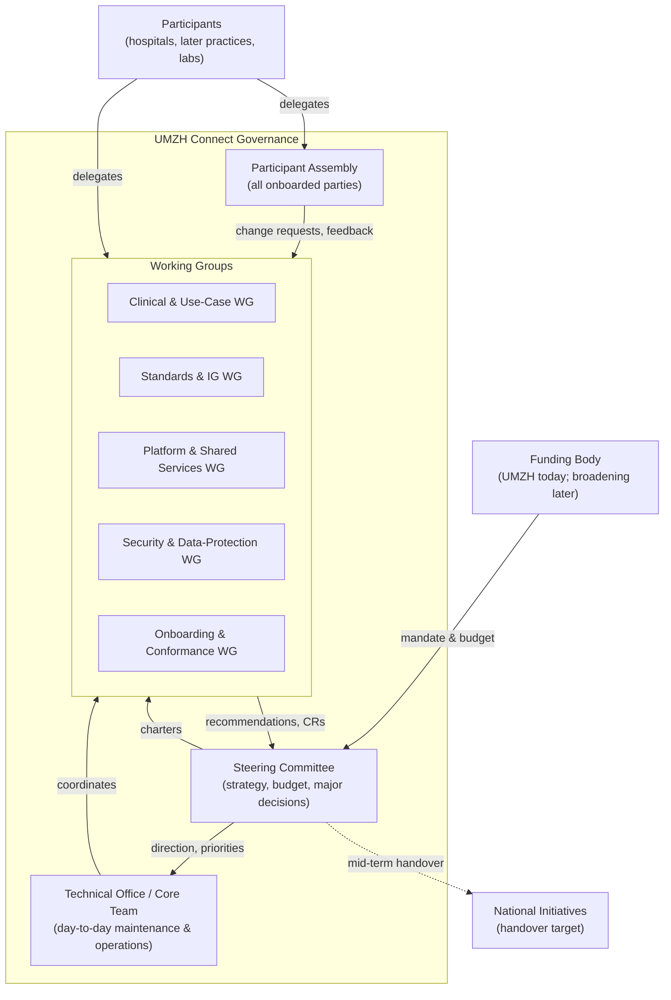
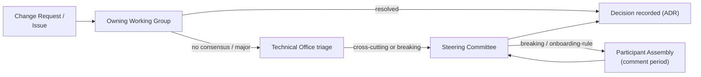
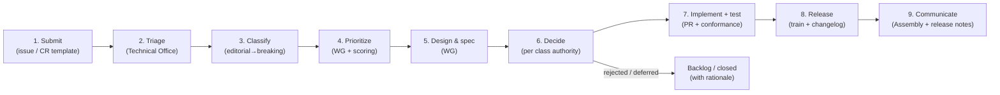
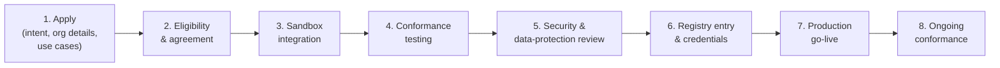
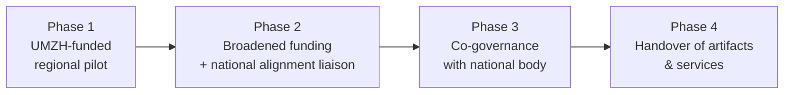

# Governance Blueprint: UMZH Connect

**Scope:** The organizational setup that develops, maintains, operates and governs the UMZH Connect ecosystem — its standards, specifications, shared services and integration artifacts.
**Status:** Blueprint / v0.1
**Date:** 2026-09-03

---

## Table of Contents

1. [Purpose & Scope](#1-purpose--scope)
2. [Guiding Principles](#2-guiding-principles)
3. [What Is Governed — Artifact & Service Inventory](#3-what-is-governed--artifact--service-inventory)
4. [Organizational Structure](#4-organizational-structure)
   - 4.1 [Overview Diagram](#41-overview-diagram)
   - 4.2 [Steering Committee](#42-steering-committee)
   - 4.3 [Technical Office (Core Team)](#43-technical-office-core-team)
   - 4.4 [Working Groups](#44-working-groups)
   - 4.5 [Participant Assembly](#45-participant-assembly)
   - 4.6 [Roles & Responsibilities (RACI)](#46-roles--responsibilities-raci)
5. [Decision-Making](#5-decision-making)
   - 5.1 [Decision Classes & Authority](#51-decision-classes--authority)
   - 5.2 [Decision Process, Quorum & Voting](#52-decision-process-quorum--voting)
   - 5.3 [Escalation Path](#53-escalation-path)
6. [Change Management](#6-change-management)
   - 6.1 [Change Request Lifecycle](#61-change-request-lifecycle)
   - 6.2 [Change Classification](#62-change-classification)
   - 6.3 [Versioning & Release Policy](#63-versioning--release-policy)
   - 6.4 [Emergency & Security Changes](#64-emergency--security-changes)
7. [Prioritization & Roadmap](#7-prioritization--roadmap)
8. [Participant Onboarding & Offboarding](#8-participant-onboarding--offboarding)
   - 8.1 [Membership Commitments](#81-membership-commitments)
   - 8.2 [Onboarding & Offboarding Pipeline](#82-onboarding--offboarding-pipeline)
9. [Operations of Shared Services](#9-operations-of-shared-services)
10. [Security, Privacy & Compliance Governance](#10-security-privacy--compliance-governance)
11. [Funding & Sustainability](#11-funding--sustainability)
12. [Intellectual Property, Licensing & Openness](#12-intellectual-property-licensing--openness)
13. [Handover to National Initiatives](#13-handover-to-national-initiatives)
14. [Meeting Cadence & Ceremonies](#14-meeting-cadence--ceremonies)
15. [Glossary](#15-glossary)

---

## 1. Purpose & Scope

UMZH Connect is an initiative to **standardize and automate clinical orders** (referrals and external service orders such as lab orders) across a network of healthcare providers. Data exchange is **API- and FHIR-based**, governed by a dedicated Implementation Guide (IG) derived from the international *Clinical Order Workflow IG* and focused on concrete use cases, precisely defined data structures, API operations and security.

To make the ecosystem function efficiently, UMZH Connect maintains a set of **shared artifacts** and operates a set of **shared services** (an mCSD registry and an authorization server), plus a reference **integration stack** that helps participants comply with the IG and integrate with their existing systems.

This blueprint defines **how that work is organized and decided** — who develops and maintains the artifacts, who operates the services, how new participants are onboarded, and how the standards and specifications evolve over time. It is deliberately technology-adjacent but **not** a technical specification; it references the technical repositories rather than restating them.

**In scope:**

- The bodies, roles and responsibilities that own the ecosystem.
- Change management, prioritization and decision-taking for all governed artifacts.
- Onboarding and ongoing governance of participants.
- Operation and service levels of the shared services.
- Funding, sustainability, and the mid-term handover to national initiatives.

**Out of scope:**

- Internal IT governance of individual participants.
- Clinical governance of the underlying medical processes.
- The detailed technical content of the IG and the services (owned by their repositories).

**Strategic aim:** establish a **nation-wide standard** for digital clinical orders and, mid-term, **hand over** the maintained artifacts and operated services to national initiatives (see [§13](#13-handover-to-national-initiatives)).

---

## 2. Guiding Principles

These principles are the tie-breakers for every decision in this document.

1. **Use-case driven.** Concrete clinical use cases are the unit of work. Each use case **defines the structural requirements** (data structures and profiles) and the **workflow requirements** (API operations and interaction patterns), **is prioritized by business value**, and is **documented and manifested as examples in the IG**. Nothing enters the standard without a driving use case.
2. **Standards-first, not product-first.** The IG and its conformance criteria are the primary asset. Services and code exist to realize and validate the standard, not the other way around.
3. **Interoperability over local optimization.** Changes that serve one participant at the expense of network-wide interoperability are rejected or generalized.
4. **Backward compatibility by default.** Breaking changes are exceptional, explicitly classified, announced with a deprecation window and coupled to a migration path.
5. **Open and transparent.** Specifications, decisions and roadmaps are public by default; deliberations are minuted; artifacts carry open licenses (see [§12](#12-intellectual-property-licensing--openness)).
6. **National-alignment ready.** Design and governance choices anticipate handover to national bodies (e.g. eHealth Suisse / national interoperability programs) and reuse Swiss base standards (CH Core and related) wherever possible.
7. **Privacy and security by design.** Data-protection and security review are built into the change and onboarding processes, not bolted on (see [§10](#10-security-privacy--compliance-governance)).
8. **Lightweight but accountable.** The smallest governance that works: clear owners, short paths, written decisions.

---

## 3. What Is Governed — Artifact & Service Inventory

Governance applies to the following assets. Each has a **maintaining working group** and a **designated maintainer** (owner) accountable for its backlog and releases.

| Asset | Repository / Location | Type | Primary Working Group |
|---|---|---|---|
| **Implementation Guide** (profiles, use cases, API operations, security) | `umzhconnect-ig` | Specification | Standards & IG WG |
| **mCSD Registry** (Organizations, Endpoints, HealthcareServices) | `umzhconnect-registry` | Shared service | Platform & Shared Services WG |
| **Authorization Server** (Keycloak, SMART/OAuth2 M2M) | `umzhconnect-auth` | Shared service | Platform & Shared Services WG |
| **Reference / Sandbox** (two-party reference implementation) | `umzhconnect-sandbox` | Reference artifact | Platform & Shared Services WG |
| **Party Integration Stack** ("cow" — single-hospital node) | `umzhconnect-cow` | Reference artifact | Platform & Shared Services WG |
| **Reference Architecture** (production single-hospital) | `umzhconnect-governance/reference-architecture.md` | Guidance | Platform & Shared Services WG |
| **Data-Protection Blueprints** (BRA, DSFA/DPIA, consent template) | `umzhconnect-governance/datenschutz/` | Compliance artifact | Security & Data-Protection WG |
| **Governance Blueprint** (this document) | `umzhconnect-governance/governance-blueprint.md` | Governance | Steering Committee |
| **Conformance & test suites** | per-repo `tests/` | Quality artifact | owning WG + Onboarding WG |

**Two governance regimes** run in parallel and must be kept in step:

- **Specification governance** — the IG and its conformance criteria (the *contract*).
- **Service & artifact governance** — the running shared services and reference code that *implement* the contract.

A change to the contract (IG) that affects the services triggers a coordinated release across both regimes (see [§6.3](#63-versioning--release-policy)).

---

## 4. Organizational Structure

### 4.1 Overview Diagram

The structure has **four layers**: a **Steering Committee** (strategic authority), a **Technical Office** (execution and operations), topic-based **Working Groups** (where the work and most recommendations happen), and a **Participant Assembly** (the community of onboarded parties). Funding sits outside the governance bodies and provides mandate and budget.

### 4.2 Steering Committee

**Purpose:** owns the strategy, budget, roadmap approval and all *major* / *breaking* decisions; the escalation point of last resort; accountable for the handover strategy.

**Composition (indicative):**

- **Chair** — appointed by the funding body (UMZH today).
- **Sponsor / funding representative(s).**
- **Technical Office lead** (see [§4.3](#43-technical-office-core-team)).
- **2–4 participant representatives**, elected by the Participant Assembly, with turnover to keep the network represented as it grows.
- **Data-protection / security lead** (chair of the Security & Data-Protection WG).
- **National-alignment liaison** (non-voting advisory seat for the target national initiative once identified).

**Responsibilities:**

- Approve the **annual roadmap** and release train dates.
- Approve **major** and **breaking** changes and any change to the security or trust model.
- Approve **onboarding** of new *classes* of participant (e.g. medical practices, labs) and any change to eligibility/conformance rules.
- Own **budget, funding model and sustainability** ([§11](#11-funding--sustainability)).
- Own the **handover plan** to national initiatives ([§13](#13-handover-to-national-initiatives)).
- Charter, merge or dissolve Working Groups.

**Cadence:** quarterly, plus extraordinary sessions for escalations and emergency changes.

### 4.3 Technical Office (Core Team)

**Purpose:** the standing, (partly) funded team that does and coordinates the day-to-day work — maintains the artifacts, **operates the shared services**, runs releases, and staffs the onboarding pipeline. This is the operational backbone that keeps the ecosystem running between committee meetings.

**Core roles:**

- **Technical Office Lead** — overall accountable for delivery and operations; sits on the Steering Committee.
- **IG / Standards Maintainer** — owns the IG repository, FSH sources, conformance criteria and changelog.
- **Platform / SRE** — operates the registry and auth server (availability, upgrades, incident response), maintains sandbox and party stack.
- **Onboarding Engineer** — runs participant onboarding, conformance testing and registry entries.
- **Security & DPO liaison** — coordinates with the Security & Data-Protection WG and the DPO function.
- **Release/Programme Manager** — runs the change pipeline, roadmap, minutes and communications.

Small ecosystems may combine these roles; the **accountabilities** must nevertheless each have a named owner.

**Responsibilities:** triage incoming change requests, run release trains, operate services to agreed SLAs ([§9](#9-operations-of-shared-services)), maintain conformance tooling, and prepare recommendations for the Working Groups and Steering Committee.

### 4.4 Working Groups

Working Groups (WGs) are where analysis, design and most recommendations happen. Each WG has a **chair**, a **charter**, an open backlog, and produces **recommendations** and **change requests** for decision. Membership is open to delegates from any participant plus co-opted experts.

| Working Group | Mandate | Typical Outputs |
|---|---|---|
| **Clinical & Use-Case WG** | Own the **use-case driven approach**: identify, prioritize (by business value) and specify clinical use cases (referrals, lab orders, future flows); for each, derive the **structural** (data-structure/profile) and **workflow** (API-operation/interaction) requirements and ensure clinical validity, so the use case can be documented and manifested as examples in the IG. | Use-case definitions with structural & workflow requirements, acceptance criteria, prioritization input |
| **Standards & IG WG** | Evolve the IG: profiles, data structures, API operations, value sets; alignment with CH Core and the international base IG. | IG change proposals, profile/binding decisions, conformance rules |
| **Platform & Shared Services WG** | Design, build and operate the registry, auth server, sandbox and party stack; deployment and reference architecture. | Service changes, SLAs, release plans, ops runbooks |
| **Security & Data-Protection WG** | Trust/security model, threat & risk assessment, DSFA/DPIA, consent model, incident response. | Security decisions, risk assessments, data-protection sign-off |
| **Onboarding & Conformance WG** | Onboarding process, conformance/certification suite, registry admission, participant support. | Onboarding checklist, conformance test suite, admission recommendations |

WGs may be **standing** (the five above) or **time-boxed task forces** chartered by the Steering Committee for a specific deliverable (e.g. "add e-prescription use case"), then dissolved.

### 4.5 Participant Assembly

**Purpose:** the forum of **all onboarded participants** — the community voice. Each participant nominates delegates. The Assembly:

- Raises and endorses **change requests** and roadmap items.
- Elects participant representatives to the Steering Committee.
- Reviews the roadmap and release notes; provides operational feedback.
- Is consulted (with a defined comment period) on **breaking changes** and onboarding-rule changes.

**Cadence:** semi-annual plenary + an always-open intake channel (issue tracker / mailing list).

### 4.6 Roles & Responsibilities (RACI)

*A = Accountable (single owner), R = Responsible (does the work), C = Consulted, I = Informed.*

| Activity | Steering Cttee | Technical Office | Relevant WG | Participant Assembly |
|---|---|---|---|---|
| Set strategy & annual roadmap | **A** | R | C | C |
| Specify a use case | I | R | **A** (Clinical) | C |
| IG editorial/minor change | I | R | **A** (Standards) | C |
| IG major/breaking change | **A** | R | C (Standards) | C |
| Operate shared services (registry/auth) | I | **A/R** | C (Platform) | I |
| Approve a release train | **A** | R | C | I |
| Prioritize the backlog | C | R | **A** (per topic) | C |
| Onboard an individual participant | I | R | **A** (Onboarding) | I |
| Onboard a new *class* of participant | **A** | R | C | C |
| Security / trust-model change | **A** | R | **R** (Security) | C |
| Data-protection sign-off (DSFA) | I | C | **A** (Security) | I |
| Funding & budget | **A** | C | I | I |
| Handover to national initiative | **A** | R | C | C |

---

## 5. Decision-Making

### 5.1 Decision Classes & Authority

Every decision is classified; the class determines who decides and how fast.

| Class | Examples | Decision Authority | Default Path |
|---|---|---|---|
| **Editorial** | Typos, doc clarifications, non-normative examples | Maintainer (Technical Office) | Merge on review |
| **Minor / non-breaking** | New optional element, additive value-set entry, new example, backward-compatible service change | Owning WG (lazy consensus) | WG approval → release train |
| **Major / normative** | New profile or API operation, new mandatory element, new use case | Owning WG **recommends**, Steering Committee **approves** | WG → SC |
| **Breaking** | Removing/renaming elements, incompatible API/security change, versioning bump | Steering Committee (with Assembly consultation) | WG → Assembly comment → SC |
| **Strategic** | Roadmap, funding, new participant class, handover, licensing | Steering Committee | SC |
| **Emergency** | Security fix, service-affecting incident | Technical Office acts, SC ratifies after the fact | Fast-track ([§6.4](#64-emergency--security-changes)) |

### 5.2 Decision Process, Quorum & Voting

**Default mode: lazy consensus.** A proposal circulated with a defined review window (e.g. 5–10 working days) and no sustained objection is **adopted**. This keeps the common case fast.

**When consensus fails or the class requires it, vote:**

- **Working Group:** simple majority of active members; the chair breaks ties. Quorum = 3 members or half of active members, whichever is greater.
- **Steering Committee:** simple majority; **major/breaking/strategic** decisions require a **two-thirds majority**. Quorum = majority of seats including the Chair. The Chair breaks ties except on breaking/strategic items, which require the two-thirds threshold rather than a casting vote.
- **Data-protection and security vetoes:** the Security & Data-Protection WG may **block** a change on documented compliance/risk grounds; the block can only be overridden by a Steering-Committee two-thirds vote **and** a recorded risk acceptance.

**Every non-editorial decision is recorded** as a short **Architecture/Decision Record (ADR)** in the owning repository: context, options, decision, consequences, and the responsible body. This is the durable audit trail.

### 5.3 Escalation Path

Escalate when: consensus fails, the change is major/breaking/strategic, it spans multiple WGs, or it touches the security/trust model, funding, or participant eligibility.

---

## 6. Change Management

All evolution of governed assets flows through a single, uniform change process, regardless of whether the target is the IG, a shared service, or a reference artifact. It builds on the existing repository conventions (e.g. the IG `CONTRIBUTING.md` and per-repo `BACKLOG.md`).

### 6.1 Change Request Lifecycle

**Stages:**

1. **Submit** — anyone (participant, WG member, Technical Office) opens a change request using a standard template (problem, affected asset, use case, proposed change, impact, urgency). Registry/onboarding-type requests follow the existing `requests/` convention where applicable.
2. **Triage** — Technical Office confirms completeness, routes to the owning WG, links duplicates.
3. **Classify** — assign a change class ([§6.2](#62-change-classification)); this sets the decision authority and SLA.
4. **Prioritize** — WG scores the item ([§7](#7-prioritization--roadmap)).
5. **Design & spec** — WG produces the concrete change (FSH edits, service design, conformance impact).
6. **Decide** — approve/reject/defer per the decision class; record an ADR.
7. **Implement & test** — PR against the repo, with example instances validated and conformance/test suites green (per repo `CONTRIBUTING.md`).
8. **Release** — bundled into the next release train, changelog updated, versions bumped ([§6.3](#63-versioning--release-policy)).
9. **Communicate** — release notes to the Participant Assembly; migration guidance for major/breaking changes.

**Transparency:** every CR is public with a visible status and, on rejection/deferral, a recorded rationale.

### 6.2 Change Classification

Classification (from [§5.1](#51-decision-classes--authority)) drives everything downstream — authority, SLA, whether Assembly consultation is required, and the versioning impact:

| Class | Compatibility | Consultation | Version Impact |
|---|---|---|---|
| Editorial | No behavior change | none | patch / none |
| Minor | Backward-compatible | WG | minor |
| Major | Backward-compatible, normative | WG + SC | minor (feature) |
| Breaking | **Not** backward-compatible | WG + SC + **Assembly** | **major** + deprecation window |
| Emergency | Varies | post-hoc | patch/hotfix |

### 6.3 Versioning & Release Policy

- **Semantic versioning** for the IG and each service (`MAJOR.MINOR.PATCH`). A **breaking** change increments MAJOR.
- **Contract/implementation coupling:** each IG version declares the **compatible ranges** of the shared services and reference stack; the registry and auth server publish which IG version(s) they satisfy. A breaking IG change is only released alongside compatible service releases.
- **Release trains:** scheduled, predictable releases (e.g. quarterly for normative IG releases; more frequent patch releases for services). Emergency releases are out-of-band.
- **Deprecation policy:** breaking changes ship with a **deprecation window** (default: at least one release train, target ≥ 6 months for elements participants integrate against), a migration guide, and — where feasible — a transition period in which old and new behavior coexist.
- **Conformance is versioned too:** the conformance/certification suite is tagged to the IG version a participant is certified against ([§8](#8-participant-onboarding--offboarding)).

### 6.4 Emergency & Security Changes

For security vulnerabilities or service-affecting incidents, the Technical Office may **act first and ratify later**:

1. Triage severity; if it endangers data, trust or availability, invoke the fast-track.
2. Apply the fix (hotfix release / service mitigation) with the Security & Data-Protection WG lead informed.
3. Notify affected participants promptly (with any required data-protection breach notification handled per [§10](#10-security-privacy--compliance-governance)).
4. Steering Committee **ratifies** the action at the next (or an extraordinary) session; a post-incident review and ADR are produced.

---

## 7. Prioritization & Roadmap

Prioritization is explicit and repeatable so the roadmap reflects value, not volume of voices.

**Scoring model (WSJF-style):** each candidate is scored on

- **Clinical / participant value** (breadth of benefit across the network),
- **Interoperability / standardization impact** (advances the nation-wide standard),
- **Compliance / risk reduction** (security, data-protection, legal),
- **National-alignment fit** (moves toward the handover target),

divided by **effort / cost**. Higher = sooner. The Clinical & Use-Case WG owns clinical value; the Standards and Platform WGs own effort and interoperability estimates; the Security WG owns risk scoring.

**Roadmap process:**

- Working Groups maintain prioritized backlogs (per-repo `BACKLOG.md`).
- The Technical Office consolidates a **draft annual roadmap** with release-train dates.
- The Participant Assembly reviews and comments.
- The Steering Committee **approves** the roadmap and any in-year re-prioritization that shifts a release train.

**Tie-breakers:** the guiding principles ([§2](#2-guiding-principles)) — standardization and interoperability win over local optimization.

---

## 8. Participant Onboarding & Offboarding

Membership in UMZH Connect is more than technical access to the network — it is a **commitment to the shared standard and its upkeep**. This section defines what members commit to ([§8.1](#81-membership-commitments)) and the process by which they join and leave ([§8.2](#82-onboarding--offboarding-pipeline)).

### 8.1 Membership Commitments

Joining is voluntary, but membership carries obligations that keep the ecosystem viable for everyone. These commitments are formalized in the **participation agreement** signed at onboarding ([§8.2](#82-onboarding--offboarding-pipeline), stage 2). By becoming a member, a participant commits to:

- **Governance participation.** Actively contribute to the bodies that steer the ecosystem — delegate members to the **Working Groups** relevant to their roles and use cases, take part in the **Participant Assembly**, and, where elected, serve on the **Steering Committee**. Membership is participatory, not passive consumption.
- **Conformant implementation & operation.** Implement **and operate IG-conformant APIs** for each of the participant's **own selected roles** (Placer and/or Fulfiller) and **selected use cases** — including passing conformance testing, running the APIs to the agreed service levels, and keeping them certified against a supported IG version as the standard evolves.
- **Contribution to open-source artifacts.** Contribute back to the shared, openly-licensed artifacts (IG, reference stack, tests, tooling) — fixes, improvements and, where appropriate, generally-useful extensions — under the project's contributor terms ([§12](#12-intellectual-property-licensing--openness)), rather than maintaining private forks that fragment interoperability.
- **Financial commitment.** *To be defined.* A member contribution (membership/onboarding fee and/or in-kind effort) is anticipated as the funding model broadens; the model, amounts and any tiering are set by the Steering Committee ([§11](#11-funding--sustainability)) and applied transparently and proportionately.

Additional commitments that follow from the above and are likewise encoded in the participation agreement:

- **Data protection & security.** Act as **controller** of one's own patient data, maintain the required DSFA/DPIA and consent handling ([§10](#10-security-privacy--compliance-governance)), meet the **security baseline** and reference architecture, apply security patches in a timely manner, and honour **incident and breach reporting** duties.
- **Operational reliability & directory accuracy.** Meet agreed **availability/SLA** obligations as a service provider, keep the participant's **mCSD registry** records and endpoints accurate and current, and practise credential/key hygiene (rotation, safekeeping).
- **Conformance upkeep & migration.** Adopt **breaking changes within the published deprecation window** ([§6.3](#63-versioning--release-policy)), re-certify when adopting a new normative IG version, and take part in interoperability/regression testing when asked.
- **Good-faith collaboration & transparency.** Respect recorded decisions (ADRs) and the change process, share operational feedback, and avoid unilateral non-standard behaviour that undermines network-wide interoperability.
- **Named contacts & orderly exit.** Designate a **technical** and a **governance** contact, and give **advance notice** before leaving, following the offboarding process ([§8.2](#82-onboarding--offboarding-pipeline)) and remaining data-protection obligations on exit.

Commitments scale with involvement: a member acting only as a Placer for a single use case carries a lighter operational load than one operating Fulfiller APIs across several use cases. The **role/use-case selection a member declares at onboarding sets the scope of its obligations.**

### 8.2 Onboarding & Offboarding Pipeline

Onboarding is a **governed, staged pipeline** owned by the Onboarding & Conformance WG and executed by the Technical Office. Admitting a *new class* of participant (e.g. practices, labs) is a Steering-Committee decision; admitting an *individual* participant of an approved class is an operational decision.

**Stages:**

1. **Apply** — the organization declares intent, contacts, target use cases and role(s) (Placer / Fulfiller).
2. **Eligibility & agreement** — meets participation criteria; signs the **participation agreement** (obligations, data-protection roles, SLAs, IP/licensing acceptance, security baseline).
3. **Sandbox integration** — integrate against `umzhconnect-sandbox` / party stack (`umzhconnect-cow`); no production data.
4. **Conformance testing** — pass the versioned conformance suite for the target IG version (data structures, API operations, security profile).
5. **Security & data-protection review** — deployment reviewed against the reference architecture and the DSFA/consent blueprints; risk sign-off by the Security & Data-Protection WG.
6. **Registry entry & credentials** — Technical Office creates the participant's `Organization`/`Endpoint`/`HealthcareService` records in the **mCSD registry** and provisions **auth-server** client(s) (SMART Backend Services). Registry changes follow the existing `requests/` and id-convention rules.
7. **Production go-live** — coordinated cutover; monitoring in place.
8. **Ongoing conformance** — participants track supported IG versions; **re-certification** is required when they adopt a new normative IG version or when their integration materially changes.

**Offboarding:** a defined process to **revoke auth-server credentials**, **remove or deactivate registry records**, and handle data-protection obligations (retention, deletion) on exit, whether voluntary or for cause (e.g. sustained non-conformance or security breach). Offboarding for cause is a Steering-Committee decision.

**Conformance & certification** is the trust anchor of the network: a participant is *certified against a specific IG version*, and that status is the precondition for a live registry entry and production credentials.

---

## 9. Operations of Shared Services

UMZH Connect **runs** the shared services; participants depend on them, so they are governed to explicit service levels.

**Operated services:** the **mCSD registry** (`umzhconnect-registry`) and the **authorization server** (`umzhconnect-auth`). The **sandbox** and **party stack** are maintained as reference artifacts (best-effort availability).

**Service management commitments (to be finalized per funding):**

- **Availability targets (SLA/SLO)** per shared service, with published maintenance windows.
- **Incident management** — severity classes, response/restoration targets, a single status/communication channel, post-incident reviews.
- **Change/upgrade management** — service changes follow the same CR process ([§6](#6-change-management)); registry and auth-server upgrades are announced and, where they affect the contract, coupled to an IG-compatible release.
- **Backup, DR & data integrity** — for the registry directory and the auth-server configuration/keys, with tested recovery.
- **Key & trust management** — lifecycle of signing keys, client credentials and JWKS, rotation policy, and the trust list; changes to the trust model are security-class decisions.
- **Observability & audit** — operational metrics and security-relevant audit logging, retained per the data-protection blueprints.
- **Registry data governance** — the directory is authoritative for discovery; entries are created/updated only through the onboarding/change process and obey the resource-id conventions enforced in-repo.

Operational runbooks live with each service repository; this blueprint governs **who** commits to **what levels** and **how changes are authorized**.

---

## 10. Security, Privacy & Compliance Governance

Security and data protection are **cross-cutting gates**, owned by the Security & Data-Protection WG and embedded in both the change and onboarding processes.

- **Data-protection artifacts** live in `umzhconnect-governance/datenschutz/`: the **BRA** (Bearbeitungsreglement / records of processing), the **DSFA/DPIA blueprint**, and the **consent template**. These are governed artifacts with their own change process and are prerequisites participants align to.
- **Roles under data-protection law:** the blueprint clarifies controller/processor roles between UMZH Connect (as operator of shared services) and participants (as controllers of their clinical data); the participation agreement encodes these.
- **Consent model:** the ecosystem is consent-centric (fine-grained, policy-enforced authorization). Changes to the consent model are **security-class** decisions with WG sign-off.
- **Security review is mandatory** for: any change touching the trust/security model, the auth server, the registry's exposure, or a participant's production deployment. The WG holds a **compliance veto** ([§5.2](#52-decision-process-quorum--voting)).
- **Threat & risk management:** maintain a living threat model and risk register; feed high-severity items into prioritization ([§7](#7-prioritization--roadmap)).
- **Incident & breach handling:** security incidents use the emergency-change fast-track ([§6.4](#64-emergency--security-changes)); personal-data breaches additionally follow statutory notification duties, coordinated with the DPO function.
- **Auditability:** decisions (ADRs), registry changes, credential issuance and conformance results are traceable — the evidence base for both operational trust and eventual handover.

---

## 11. Funding & Sustainability

**Today:** funding is provided by **UMZH (Universitäre Medizin Zürich)**, which holds the initial mandate and appoints the Steering Committee Chair.

**Broadening (planned):** the model is designed to accept additional funding sources without changing the governance skeleton:

- **Participant contributions** (membership/onboarding fees or in-kind WG staffing), calibrated to not deter adoption of a public-good standard.
- **Cantonal / public-health co-funding** as the standard moves toward nation-wide scope.
- **National-programme funding** as handover approaches ([§13](#13-handover-to-national-initiatives)).

**Sustainability principles:**

- **Separate "standard" from "service" costs.** The IG and specifications are a public good; running the shared services has ongoing operational cost. Funding must cover both, but they are budgeted distinctly so the standard survives even if service operation is later transferred.
- **No lock-in through funding.** A single funder does not gain disproportionate control; strategic authority stays with the Steering Committee under its voting rules.
- **Transparent budget.** The Steering Committee approves and publishes an annual budget and a multi-year sustainability plan, including the runway needed to reach a viable handover.

---

## 12. Intellectual Property, Licensing & Openness

- **Open by default.** Specifications and code are published under open licenses (the service repositories already carry `LICENSE` files; the IG is openly published). New artifacts adopt a compatible open license by default.
- **Contributor terms.** Contributions are accepted under a clear inbound license / contributor agreement so the artifacts can be **relicensed-compatible and transferable** to a national body without per-contributor renegotiation — a precondition for clean handover.
- **Trademark / naming.** "UMZH Connect" naming and any conformance mark are governed by the Steering Committee; use of a conformance mark is tied to certification status ([§8](#8-participant-onboarding--offboarding)).
- **Standards alignment.** The IG builds on the international *Clinical Order Workflow IG* and Swiss base standards (CH Core and related); upstream licensing and attribution are respected, and changes of general value are offered upstream where appropriate.

---

## 13. Handover to National Initiatives

A core strategic aim is to establish a **nation-wide standard** and, **mid-term, hand over** the maintained artifacts and operated services to national initiatives (e.g. eHealth Suisse / national interoperability programs). Governance is built to make that transition clean rather than disruptive.

**Readiness criteria (the handover must not happen before these hold):**

- Stable, versioned IG with a healthy conformance suite and multiple certified participants.
- Shared services operated to documented SLAs with runbooks, DR and audit in place.
- Open, transferable licensing and contributor terms ([§12](#12-intellectual-property-licensing--openness)).
- A named national counterpart with the mandate and capacity to take ownership.
- A funding path on the national side for continued operation.

**Transition model:**

- **Phase 1 — Pilot:** UMZH-funded, regional participants, standard and services proven.
- **Phase 2 — Broaden:** additional funders and participants; a **national-alignment liaison** joins the Steering Committee (advisory) to keep design nationally compatible.
- **Phase 3 — Co-governance:** the national initiative co-chairs relevant bodies; joint roadmap.
- **Phase 4 — Handover:** transfer of repositories, service operation, registry authority, trademark/conformance mark, and governance to the national body, with a transition period and continuity guarantees for participants.

**Continuity guarantees:** participants certified under UMZH Connect remain valid across the handover; the IG version and registry/credentials are preserved or migrated with notice. The Steering Committee owns and periodically reviews the handover plan.

---

## 14. Meeting Cadence & Ceremonies

| Body / Ceremony | Cadence | Primary Output |
|---|---|---|
| Steering Committee | Quarterly (+ extraordinary) | Strategy, roadmap approval, major/breaking/strategic decisions, budget |
| Technical Office stand-up / sync | Weekly | Triage, operations, release progress |
| Working Groups | Bi-weekly to monthly (per WG) | Recommendations, CRs, ADRs |
| Release train | Quarterly (IG) / rolling (services) | Versioned releases + changelog |
| Participant Assembly plenary | Semi-annual | Feedback, elections, breaking-change consultation |
| Backlog review / prioritization | Monthly (per WG) | Prioritized backlog, roadmap input |
| Post-incident review | Per incident | Root cause, ADR, preventive actions |

---

## 15. Glossary

| Term | Meaning |
|---|---|
| **IG** | Implementation Guide — the normative FHIR specification (`umzhconnect-ig`). |
| **mCSD** | *Mobile Care Services Discovery* — the IHE profile behind the registry of Organizations/Endpoints/HealthcareServices. |
| **Shared services** | The centrally operated registry and authorization server. |
| **Party / Participant** | An onboarded healthcare provider (hospital; later practice, lab) acting as Placer and/or Fulfiller. |
| **Placer / Fulfiller** | The ordering party and the servicing party in a clinical order workflow. |
| **CR** | Change Request. |
| **ADR** | Architecture/Decision Record — the durable written record of a decision. |
| **WG** | Working Group. |
| **WSJF** | *Weighted Shortest Job First* — the value-over-effort prioritization heuristic. |
| **DSFA / DPIA** | Data-Protection Impact Assessment (*Datenschutz-Folgenabschätzung*). |
| **BRA** | *Bearbeitungsreglement* — records/rules of personal-data processing. |
| **Conformance / certification** | Verified compliance of a participant's implementation with a specific IG version. |
| **UMZH** | Universitäre Medizin Zürich — the current funding body and mandate holder. |

---

*This is a living blueprint. It is itself a governed artifact ([§3](#3-what-is-governed--artifact--service-inventory)); changes follow the process in [§6](#6-change-management) and are approved by the Steering Committee.*
