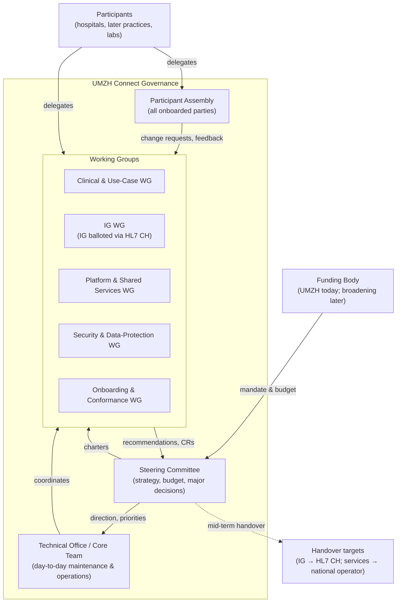
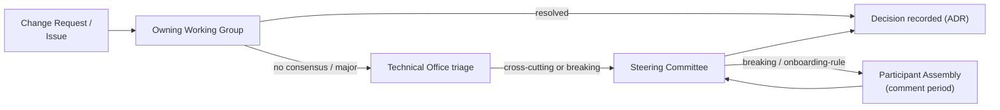
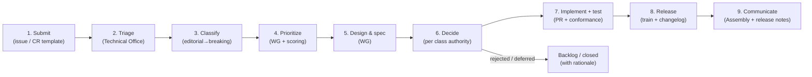
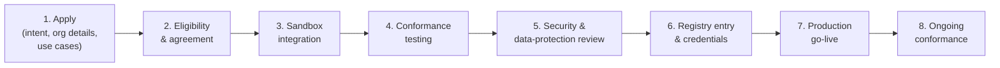
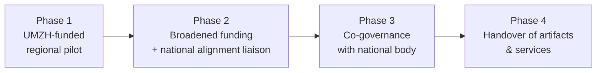

# Governance Blueprint — Rationale & Background

**Companion to** [`governance-blueprint.md`](governance-blueprint.md). **Non-normative.**
This document explains *why* the governance model is shaped the way it is, holds
the diagrams, records the composition detail that the core keeps terse, describes
how the structure grows as the network grows, and tracks the open items. Where it
differs from the core blueprint, **the core blueprint governs**.

---

## Table of Contents

1. [Why this shape](#1-why-this-shape)
2. [Principles — the reasoning](#2-principles--the-reasoning)
3. [Organizational structure — diagram & notes](#3-organizational-structure--diagram--notes)
4. [Decision-making — escalation diagram](#4-decision-making--escalation-diagram)
5. [Change management — lifecycle diagram](#5-change-management--lifecycle-diagram)
6. [Prioritization — the scoring model](#6-prioritization--the-scoring-model)
7. [Onboarding — pipeline diagram](#7-onboarding--pipeline-diagram)
8. [Scaling the governance](#8-scaling-the-governance)
9. [Handover to national initiatives — transition model](#9-handover-to-national-initiatives--transition-model)
10. [Open items](#10-open-items)

---

## 1. Why this shape

**Standards-first.** UMZH Connect's primary asset is a *contract* — the IG and its
conformance criteria. Everything else (the registry, the auth server, the
reference stacks) exists to realize and validate that contract. The governance
therefore runs **two regimes in parallel**: specification governance for the
contract, and service & artifact governance for the code that implements it. They
are deliberately kept in step — a contract change that affects the services is
released as a coordinated pair — but they are distinct so the standard can
outlive any particular operator (important for the handover, §9).

**Lightweight but accountable.** The section headings of the core blueprint make
the model look heavier than day-to-day life under it. In practice the common path
is short: a change is proposed in a Working Group, adopted by lazy consensus if
no one sustains an objection, and shipped in the next release train. The heavier
machinery — Assembly consultation, two-thirds Steering-Committee votes, post-hoc
ratification — engages **only** for breaking, strategic, or security-critical
change. The structure is designed for the network it will become, not only the
one it is today; §8 describes how it is run in a reduced configuration until the
volume justifies more.

**Built for handover.** The two regimes have different long-term homes: the **IG
goes to HL7 CH** (already balloted through HL7 CH; adoption as an HL7 CH IG is the
remaining step, so by handover time little is left to transfer — core blueprint
§5.4, open item 11), and the **shared services go to a national operator**
(eHealth Suisse or a cantonal/federal body). Choosing open licenses, transferable
contributor terms, HL7 CH balloting, versioned conformance, documented SLAs and an
auditable decision trail from the start is what makes a later handover an
administrative step rather than a rebuild.

---

## 2. Principles — the reasoning

1. **Use-case driven.** The failure mode of interoperability projects is
   standardizing in the abstract. Tying every profile and API operation to a
   named clinical use case with a business-value case keeps the IG small, keeps
   examples concrete, and gives prioritization something objective to work with.
2. **Standards-first, not product-first.** If the running services became the
   asset, the standard would ossify around one implementation and handover would
   be impossible. The contract leads; implementations follow.
3. **Interoperability over local optimization.** A change that helps one
   participant but fragments the network is either generalized so it helps
   everyone, or rejected. This is the most frequently needed tie-breaker.
4. **Backward compatibility by default.** Participants integrate real clinical
   systems against this contract. Breaking them is sometimes necessary but is
   always exceptional, announced, dated, and paired with a migration path.
5. **Open and transparent.** Public specifications, minuted deliberations and
   open licenses are both a trust mechanism for participants and a precondition
   for handover to a public body.
6. **HL7 CH aligned.** Building the IG on CH Core and the related Swiss IGs, and
   balloting it through HL7 CH, makes the national standards body the process the
   IG lives in — not a late handover target bolted on at Phase 4. The IG is
   balloted through HL7 CH today while still UMZH Connect-maintained; adoption as
   an HL7 CH IG is the remaining step (§10, item 11). The trade-off is cadence:
   HL7 CH ballots run on their own calendar, slower than an internal release
   train, which is why the transition is phased (§9).
7. **Privacy and security by design.** Health data and a shared trust fabric mean
   data-protection and security review are gates in the change and onboarding
   flow, with a compliance veto — not a review bolted on at the end.
8. **Lightweight but accountable.** Every body, role and ceremony has to earn its
   place. New WGs are chartered when a real backlog exists and dissolved when it
   is done; the pilot configuration (§8) is the default until growth forces
   expansion.

---

## 3. Organizational structure — diagram & notes

Four layers: a **Steering Committee** (strategic authority), a **Technical
Office** (execution and operations), topic-based **Working Groups** (where the
work and most recommendations happen), and a **Participant Assembly** (the
community of onboarded parties). Funding sits outside the governance bodies and
provides mandate and budget. The diagram shows the full (post-pilot)
configuration.

### Steering Committee — composition (indicative)

- **Chair** — appointed by the funding body (UMZH today).
- **Sponsor / funding representative(s).**
- **Technical Office Lead.**
- **2–4 participant representatives**, elected by the Participant Assembly, with
  turnover to keep the network represented as it grows.
- **Data-protection / security lead** (chair of the Security & Data-Protection WG).
- **National-alignment liaison** — non-voting advisory seat for the target
  national initiative once identified.

The SC **fixes and publishes its exact voting-seat roster**; quorum and the
two-thirds threshold in the core blueprint (§5.2) are computed against that
roster, and the national-alignment liaison is excluded from both.

### Technical Office — core roles

- **Technical Office Lead** — overall accountable for delivery and operations;
  sits on the Steering Committee.
- **IG / Standards Maintainer** — owns the IG repository, FSH sources,
  conformance criteria and changelog; the liaison to HL7 CH for the IG's
  comment cycles and publication.
- **Platform / SRE** — operates the registry and auth server (availability,
  upgrades, incident response); maintains sandbox and party stack.
- **Onboarding Engineer** — runs participant onboarding, conformance testing and
  registry entries.
- **Security & DPO liaison** — coordinates with the Security & Data-Protection WG
  and the DPO function.
- **Release / Programme Manager** — runs the change pipeline, roadmap, minutes
  and communications.

Small ecosystems combine these roles; each **accountability** must nonetheless
have a single named owner.

### Working Groups — mandates & typical outputs

| Working Group | Mandate | Typical outputs |
|---|---|---|
| **Clinical & Use-Case WG** | Own the use-case driven approach: identify, prioritize (by business value) and specify clinical use cases (referrals, lab orders, future flows); for each, derive the structural (data-structure/profile) and workflow (API-operation/interaction) requirements and ensure clinical validity, so the use case can be documented and manifested as examples in the IG. | Use-case definitions with structural & workflow requirements, acceptance criteria, prioritization input |
| **IG WG** | Own and evolve the IG: profiles, data structures, API operations, value sets, FSH, conformance rules. Runs the IG's **HL7 CH comment cycle and reconciliation** (core §5.4); prepares the IG for adoption as an HL7 CH IG (open item 11); keeps it built on CH Core and related Swiss IGs. | IG change proposals, profile/binding decisions, comment reconciliation records, conformance rules |
| **Platform & Shared Services WG** | Design, build and operate the registry, auth server, sandbox and party stack; deployment and reference architecture. | Service changes, SLAs, release plans, ops runbooks |
| **Security & Data-Protection WG** | Trust/security model, threat & risk assessment, DSFA/DPIA, consent model, incident response. | Security decisions, risk assessments, data-protection sign-off |
| **Onboarding & Conformance WG** | Onboarding process, conformance/certification suite, registry admission, participant support. | Onboarding checklist, conformance test suite, admission recommendations |

### Participant Assembly

The forum of **all onboarded participants**. Each participant nominates delegates.
The Assembly raises and endorses change requests and roadmap items; elects
participant representatives to the Steering Committee; reviews the roadmap and
release notes; and is consulted, with a defined comment period, on breaking
changes and onboarding-rule changes. It is advisory — it has no direct vote or
veto in the core process; its influence runs through the representatives it
elects and the comment periods it is guaranteed. Cadence: semi-annual plenary
plus an always-open intake channel (issue tracker / mailing list).

---

## 4. Decision-making — escalation diagram

Escalate when consensus fails, the change is major/breaking/strategic, it spans
multiple WGs, or it touches the security/trust model, funding, or participant
eligibility. Every non-editorial outcome lands as an ADR in the owning
repository.

---

## 5. Change management — lifecycle diagram

The intake, triage, prioritization and transparency steps are uniform across the
IG, the shared services and the reference artifacts, and build on existing
per-repo conventions (`CONTRIBUTING.md`, `BACKLOG.md`, `requests/`). Where they
diverge is the **decide/release** stage: a substantive IG change runs HL7 CH's
standards process (core blueprint §5.4), while a service change is decided by the
owning WG or SC and shipped on the internal release train. Transparency is the
constant: every CR is public with a visible status, and a rejection or deferral
carries a written rationale.

---

## 6. Prioritization — the scoring model

The core blueprint names four value dimensions over an effort denominator. The
working rubric:

- Each dimension — **clinical / participant value**, **interoperability /
  standardization impact**, **compliance / risk reduction**, **national-alignment
  fit** — is scored **1, 2, 3, 5, 8, 13** (a Fibonacci-style scale; higher =
  more).
- **Effort / cost** is scored on the same scale by the IG and Platform WGs.
- **Priority score = (sum of the four value scores) ÷ effort.** Higher scores are
  scheduled sooner.
- Ownership of the inputs: the Clinical & Use-Case WG owns clinical/participant
  value; the IG and Platform WGs own effort and interoperability impact;
  the Security & Data-Protection WG owns risk reduction; the national-alignment
  liaison (or, absent one, the Technical Office Lead) owns national-alignment fit.

The weights are deliberately equal in v0.3. If experience shows one dimension
should dominate (most likely compliance/risk), the SC can adjust the weighting as
a strategic decision and record it here.

---

## 7. Onboarding — pipeline diagram

Admitting a *new class* of participant (practices, labs) is a Steering-Committee
decision; admitting an *individual* participant of an already-approved class is an
operational decision for the Technical Office and the Onboarding & Conformance WG.

**Commitments scale with involvement.** A member acting only as a Placer for a
single use case carries a lighter operational load than one operating Fulfiller
APIs across several use cases. The role/use-case selection a member declares at
onboarding sets the scope of its obligations, and re-certification is tied to the
IG versions it actually adopts.

---

## 8. Scaling the governance

The core blueprint's §4.4 defines a reduced **pilot configuration**: two merged
Working Groups, a Steering Committee and Technical Office that may sit jointly,
and no Participant Assembly until there are enough participants to elect
representatives. This section describes when and how the structure expands.

| Growth trigger | Change |
|---|---|
| **≥ 4 onboarded participants** | Stand up the Participant Assembly; hold the first election of participant representatives to the Steering Committee. |
| **A Working Group's backlog cannot be worked within its meeting cadence for two consecutive quarters** | Split that merged WG into its constituent standing WGs (e.g. Standards & Clinical → Clinical & Use-Case WG + IG WG). |
| **The IG stabilizes and HL7 CH is ready to adopt it** | Move the IG from UMZH Connect-maintained-but-HL7-CH-balloted to an **HL7 CH IG**: HL7 CH becomes publisher/owner and a dedicated HL7 CH working group (Arbeitsgruppe) is set up for it under the Technical Committee (core blueprint §5.4). |
| **A second participant class is admitted** (practices or labs) | Charter a dedicated onboarding task force for that class; review eligibility and conformance rules. |
| **Shared-service operations exceed best-effort** (a participant depends on them for production clinical workflow) | Formalize SLAs/SLOs, on-call and incident process; separate the Platform role from the Security role in the Technical Office. |
| **A national counterpart is identified** | Seat the non-voting national-alignment liaison on the Steering Committee; begin joint roadmap work (transition Phase 2, §9). |

The Steering Committee reviews the configuration at least annually and records any
expansion or contraction as a strategic ADR. Bodies can also be **contracted**
again if activity falls — the same "earn its place" test applies in both
directions.

---

## 9. Handover to national initiatives — transition model

- **Phase 1 — Pilot:** UMZH-funded, regional participants; standard and services
  proven. The IG is UMZH Connect-maintained and **balloted through HL7 CH**.
- **Phase 2 — Broaden:** additional funders and participants; the IG is **adopted
  as an HL7 CH IG** (HL7 CH becomes publisher/owner; a dedicated HL7 CH working
  group is set up for it under the Technical Committee); a national-alignment
  liaison joins the Steering Committee (advisory).
- **Phase 3 — Co-governance:** the national initiative co-chairs relevant bodies;
  joint roadmap. The IG is maintained under HL7 CH rules with UMZH Connect as an
  active project contributor.
- **Phase 4 — Handover:** the IG is an HL7 CH IG (little left to transfer);
  service operation, registry authority, trademark/conformance mark and the
  remaining governance transfer to the national operator, with a transition
  period and continuity guarantees for participants.

**Readiness criteria** (all must hold before Phase 4 — see core blueprint §13):
stable versioned IG with a healthy conformance suite and multiple certified
participants; the IG adopted as an HL7 CH IG; services operated to documented SLAs
with runbooks, DR and audit; open transferable licensing and contributor terms; a
named national **service** operator with mandate and capacity; a national funding
path.

**Continuity guarantees:** participants certified under UMZH Connect stay valid
across the handover; the IG version and registry/credentials are preserved or
migrated with notice.

**If no national service operator emerges:** the IG still has a home (HL7 CH), so
the risk is confined to the shared services. The Steering Committee's annual
review of the handover plan explicitly considers the fallback for the services —
continued regional operation under broadened funding, transfer to another neutral
steward, or a planned wind-down with sufficient notice for participants to adapt.
The pilot is not open-ended by default; sustainability (core blueprint §11) has to
be re-confirmed each budget cycle.

---

## 10. Open items

Items deliberately unresolved in v0.3, to be closed as the initiative matures.
Each should become a change request against this blueprint.

| # | Open item | Owner | Needed by |
|---|---|---|---|
| 1 | **Legal form of UMZH Connect** (project within UMZH, association, foundation, …) — the entity that signs participation agreements, holds transferable IP, and operates the services. | Steering Committee + UMZH legal | Before the first external participation agreement is signed |
| 2 | **Liability & indemnification for the shared services** — remedies for SLA breach, outage in the clinical path, and limitation of liability. To be reflected in the participation agreement and §9. | Steering Committee + legal | With item 1 |
| 3 | **Conflict-of-interest / recusal policy** for Steering Committee votes (e.g. a participant representative on a vote about their own organization's offboarding-for-cause or fees). | Steering Committee | Before the SC takes its first adverse or fee decision |
| 4 | **Dispute resolution & appeal** — governing law and a dispute-resolution mechanism for the participation agreement; an appeal path for a participant contesting offboarding-for-cause; handling of participant-vs-participant disputes. | Steering Committee + legal | With item 1 |
| 5 | **Bootstrap / v1.0 approval** — who seats the first Steering Committee and appoints the initial WG chairs, and who approves this blueprint at v1.0 given the SC does not yet exist. | UMZH (as mandate holder) | Before v1.0 |
| 6 | **Financial model** — member contribution (fee and/or in-kind), amounts, any tiering; the split between "standard" and "service" budgets; multi-year sustainability plan. (Core blueprint §8.1, §11.) | Steering Committee | As funding broadens beyond UMZH |
| 7 | **Service levels** — concrete availability targets, incident severity classes and response/restoration targets, maintenance-window policy for the registry and auth server. (Core blueprint §9.) | Platform & Shared Services WG | Before any participant runs production clinical workflow against the services |
| 8 | **Steering Committee voting-seat roster** — the exact number and allocation of voting seats, so quorum and the two-thirds threshold are unambiguous. (Core blueprint §5.2.) | Steering Committee | At first constitution of the SC |
| 9 | **Data-protection role of the shared services** — the definitive controller/processor analysis for the registry and auth-server data, recorded in the BRA and reflected in the participation agreement. (Core blueprint §10.) | Security & Data-Protection WG + DPO | Before the first external participation agreement is signed |
| 10 | **Prioritization weighting** — confirm or adjust the equal weighting of the four value dimensions in §6 once there is scoring experience. | Steering Committee | After the first roadmap cycle |
| 11 | **Adoption of the IG as an HL7 CH IG** — the IG is already balloted through HL7 CH; agree the terms on which HL7 CH becomes publisher/owner and a dedicated HL7 CH working group (Arbeitsgruppe) is set up for it under the Technical Committee. (Core blueprint §5.4.) | IG WG + Steering Committee | Phase 2 (broaden) |
| 12 | **IG license reconciliation** — align the IG's CC0 intent with the HL7 International license on the upstream COW IG and with HL7 CH's IG-licensing conventions. (Core blueprint §12.) | IG WG + legal | Immediate — the current HL7 CH balloting may already impose licensing terms; confirm what applies |
