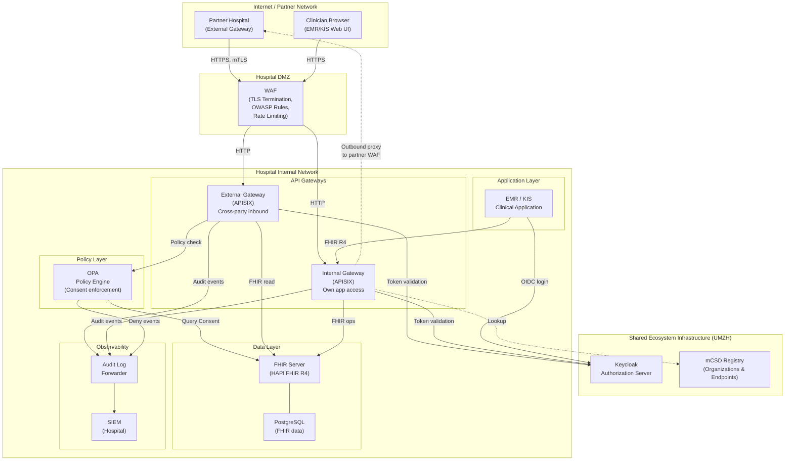

# Reference Architecture: Production-Grade Single-Hospital Implementation

**Scope:** One hospital (Placer or Fulfiller) connecting to the umzhconnect ecosystem  
**Date:** 2026-05-22

---

## Table of Contents

1. [Overview](#1-overview)
2. [Architecture Diagram](#2-architecture-diagram)
3. [Network Zones](#3-network-zones)
4. [Component Descriptions](#4-component-descriptions)
   - 4.1 [WAF / TLS Termination](#41-waf--tls-termination)
   - 4.2 [External Gateway (APISIX)](#42-external-gateway-apisix)
   - 4.3 [Internal Gateway (APISIX)](#43-internal-gateway-apisix)
   - 4.4 [OPA Policy Engine](#44-opa-policy-engine)
   - 4.5 [FHIR Server](#45-fhir-server)
   - 4.6 [Clinical Application (EMR/KIS)](#46-clinical-application-emrkis)
   - 4.7 [Audit Pipeline / SIEM Integration](#47-audit-pipeline--siem-integration)
5. [Shared Infrastructure](#5-shared-infrastructure)
   - 5.1 [Authorization Server (Keycloak)](#51-authorization-server-keycloak)
   - 5.2 [mCSD Organization Registry](#52-mcsd-organization-registry)
6. [Request Flows](#6-request-flows)
   - 6.1 [Inbound Cross-Party Request (External)](#61-inbound-cross-party-request-external)
   - 6.2 [Outbound Cross-Party Request (Internal to Partner)](#62-outbound-cross-party-request-internal-to-partner)
   - 6.3 [Internal Clinical Application Access](#63-internal-clinical-application-access)
7. [TLS Strategy](#7-tls-strategy)
8. [Key Security Controls per Component](#8-key-security-controls-per-component)
9. [Deployment Considerations](#9-deployment-considerations)
10. [Deviations from Sandbox](#10-deviations-from-sandbox)

---

## 1. Overview

This document describes a production-grade architecture for a single hospital participating in the umzhconnect ecosystem. It is derived directly from the sandbox reference implementation and replaces sandbox-only simplifications (single shared HAPI multi-tenant instance, self-signed certs, no WAF) with production patterns.

**Core principle:** The hospital controls all per-party components autonomously. Only the Authorization Server (Keycloak) and the mCSD Organization Registry are shared across all participants and operated by the ecosystem operator (UMZH).

**Per-hospital components (hospital-owned and operated):**
- WAF + TLS termination
- External API gateway (inbound cross-party requests)
- Internal API gateway (own application access)
- OPA policy engine (consent-gated authorization)
- FHIR server + database
- Audit pipeline to hospital SIEM

**Shared components (ecosystem operator):**
- Keycloak Authorization Server
- mCSD Organization & Endpoint Registry

---

## 2. Architecture Diagram



---

## 3. Network Zones

| Zone | Components | Trust Level | Accessible From |
|------|-----------|-------------|-----------------|
| **Internet / Partner Network** | Partner external gateway, clinician browsers | Untrusted | Public internet |
| **Hospital DMZ** | WAF | Semi-trusted; all traffic TLS-terminated here | Internet only |
| **Hospital Internal Network** | Gateways, OPA, FHIR server, EMR | Trusted internal | DMZ (WAF-filtered) + internal hosts |
| **Shared Ecosystem (UMZH)** | Keycloak, mCSD Registry | Trusted external; own TLS + access controls | Hospitals and authorized clients |

**Firewall rules (minimum):**
- DMZ → Internal: only WAF egress ports (8080, 8082) to named gateway hosts
- Internal gateways → FHIR server: port 8080 only
- Internal gateways → OPA: port 8181 only
- Internal gateways → Keycloak (shared): HTTPS/443 outbound
- Internal gateways → mCSD Registry (shared): HTTPS/443 outbound
- FHIR server → PostgreSQL: port 5432 to named DB host only
- No direct inbound from internet to any Internal zone host

---

## 4. Component Descriptions

### 4.1 WAF / TLS Termination

The WAF is the single ingress point for all external traffic. The hospital's existing WAF infrastructure handles this role; no new WAF component needs to be introduced if one is already in place.

**Responsibilities:**
- TLS termination (own certificate, hospital PKI or public CA)
- Mutual TLS (mTLS) for partner-to-partner traffic (client certificate from partner hospital)
- OWASP Core Rule Set (CRS) screening for web application attacks
- Rate limiting per source IP / partner identity
- DDoS mitigation (SYN flood, HTTP flood)
- Request size limits (block oversized FHIR bundles before they reach the gateway)
- SNI-based routing to distinguish external gateway traffic from internal application traffic

**Routing rules:**

| Incoming Host / Path | Forwarded To |
|---------------------|--------------|
| `fhir-external.hospital.ch/*` | External Gateway (APISIX) |
| `app.hospital.ch/*` | Internal Gateway (APISIX) |

**Key configuration:**
- TLS 1.2 minimum; TLS 1.3 preferred
- mTLS required for paths under `/fhir/` on the external gateway (partner-to-partner)
- Certificate pinning or partner CA verification for incoming mTLS connections
- Pass `X-Forwarded-For`, `X-SSL-Client-Cert` headers downstream for audit logging

**Sandbox equivalent:** No WAF in sandbox — gateways are directly exposed on ports 8080–8083.

---

### 4.2 External Gateway (APISIX)

Handles all **inbound** cross-party FHIR requests from partner hospitals. Mirrors `apisix-{party}-external` from the sandbox.

**Responsibilities:**
- JWT validation (RS256, Keycloak JWKS endpoint)
- Role enforcement via `umzh-role-check` Lua plugin (validates `org_affiliation` claim matches the registered partner organization)
- OPA sequential proxy: forwards request metadata to OPA before allowing FHIR access
- Proxies approved requests to the internal FHIR server
- Rewrites self-link URLs in FHIR responses (`sub_filter`-equivalent via `response-rewrite` plugin)
- Emits structured access logs to audit forwarder

**Routes exposed (example):**

| Method | Path | OPA check | Notes |
|--------|------|-----------|-------|
| GET | `/fhir/Patient/:id` | Required | Partner reads patient demographics |
| GET | `/fhir/ServiceRequest/:id` | Required | Partner reads the referral |
| GET | `/fhir/DocumentReference/:id` | Required | Partner reads attached documents |
| GET | `/fhir/Task/:id` | Required | Partner reads task status |
| PUT/PATCH | `/fhir/Task/:id` | Required | Partner updates task (status, output) |

**No write access** to clinical resources (ServiceRequest, Patient, Consent) via the external gateway.

**Key configuration:**
- Listen on internal port (e.g., 8080); WAF handles TLS externally
- `jwt-auth` plugin: RS256, JWKS fetched from Keycloak
- `opa` plugin: sequential mode, forwards `Authorization` header + request path/method
- `response-rewrite`: rewrites `http://internal-fhir:8090/` → `https://fhir-external.hospital.ch/`

---

### 4.3 Internal Gateway (APISIX)

Handles all requests from the hospital's own clinical application (EMR/KIS). Mirrors `apisix-{party}-internal` from the sandbox.

**Responsibilities:**
- JWT validation for own application users (OIDC tokens from Keycloak)
- Routes to own FHIR server for read/write operations
- Outbound proxy route: forwards cross-party requests to the partner's external gateway (with own M2M JWT)
- Outbound lookup route: resolves Organization/Endpoint records from the shared mCSD Registry
- No OPA check on own application access (hospital trusts its own clinical app); authorization handled by Keycloak scopes

**Routes (example):**

| Path prefix | Backend | Auth |
|-------------|---------|------|
| `/fhir/` | Own FHIR server | Keycloak JWT |
| `/proxy/fhir/` | Partner external gateway (outbound) | Own M2M JWT |
| `/registry/fhir/` | mCSD Registry (shared) | None (public) |

**Key configuration:**
- `jwt-auth` plugin for own-app routes
- Outbound proxy uses `client_credentials` M2M token; token is cached and refreshed before expiry
- `response-rewrite`: rewrites partner's external URLs in proxied responses back to `/proxy/fhir/` for same-origin handling in the UI

---

### 4.4 OPA Policy Engine

Enforces consent-based authorization on the **external gateway** path only. Mirrors `opa-{party}` from the sandbox.

**Responsibilities:**
- Evaluates whether the requesting partner is authorized to access the requested FHIR resource
- Looks up the active `Consent` resource on the FHIR server to determine granted scopes
- Returns `allow: true/false` to the external gateway's OPA plugin
- Logs deny decisions for SIEM forwarding

**Policy logic (summary of `apisix.rego`):**

```
allow if:
  token.valid
  AND token.org_affiliation == consent.performer_org
  AND requested_resource_id IN consent.authorized_resource_ids
  AND consent.status == "active"
  AND now < consent.period.end
```

**Key configuration:**
- OPA data file (`config-{party}.json`): `fhir_base` URL of the local FHIR server, `required_role`
- OPA starts in server mode (`--server`); external gateway calls `/v1/data/umzh/allow`
- No external network access from OPA — all FHIR queries go to the local FHIR server
- Policy bundle can be loaded from a remote bundle server (OPA bundle feature) for GitOps-driven policy updates

---

### 4.5 FHIR Server

Stores and serves all clinical FHIR resources for this hospital.

**Responsibilities:**
- Single-partition FHIR R4 server for this hospital only
- Persists: Patient, ServiceRequest, Task, Consent, DocumentReference, DiagnosticReport, Appointment, Observation
- FHIR operations: `$everything`, `_history`, `_search`
- Does **not** serve Organization or Endpoint resources (those live in the shared mCSD Registry)
- References to partner organizations use absolute registry URLs: `https://registry.umzhconnect.ch/fhir/Organization/HospitalX`

**Recommended configuration (HAPI FHIR):**

```yaml
spring:
  datasource:
    url: jdbc:postgresql://postgres:5432/hapi
hapi:
  fhir:
    fhir_version: R4
    partitioning:
      enabled: false          # single partition in production
    cors:
      enabled: true
      allowed_origin: https://app.hospital.ch
    narrative_enabled: false
    bulk_export_enabled: true
```

**Sizing (200k ServiceRequest+Task/year):**

| Resource | Value |
|----------|-------|
| Row count (5-year retention) | ~2M rows |
| PostgreSQL storage | ~200 GB (with history, attachments external) |
| JVM heap | 8–16 GB |
| CPU | 4–8 vCPU |
| Connection pool (pgBouncer) | 20–50 pooled connections |

**Key security:**
- No direct external access; only accessible from internal gateways and OPA
- PostgreSQL with TLS, dedicated DB user with least privilege
- FHIR `_history` and audit events logged at the DB level

---

### 4.6 Clinical Application (EMR/KIS)

The hospital's existing clinical information system or a purpose-built integration layer that drives the umzhconnect workflow.

**Integration pattern:**
- Authenticates end users via Keycloak OIDC (Authorization Code Flow)
- Calls the **Internal Gateway** for all FHIR operations (own and cross-party)
- Uses M2M `client_credentials` for background jobs (task polling, Kestra workflows)
- Reads Organization/Endpoint data from the mCSD Registry via the internal gateway's `/registry/` proxy

**This component is hospital-specific** and out of scope for the umzhconnect IG. The IG specifies the FHIR API contract; how the hospital's EMR calls it is an internal concern.

---

### 4.7 Audit Pipeline / SIEM Integration

All access events, policy decisions, and FHIR mutations are forwarded to the hospital's SIEM.

**Event sources:**

| Source | Event type | Format |
|--------|-----------|--------|
| External Gateway | Every inbound request + response code | JSON access log |
| External Gateway | OPA deny | JSON with resource ID + partner org |
| Internal Gateway | Every outbound cross-party request | JSON access log |
| OPA | Policy deny with reason | JSON |
| FHIR Server | Resource create/update/delete | FHIR AuditEvent R4 |

**Recommended pipeline:**

```
Gateway logs (stdout/file)
    → Fluent Bit (log agent, sidecar or DaemonSet)
        → Elasticsearch / Splunk / SIEM of choice
```

**FHIR AuditEvent:** HAPI generates AuditEvent resources natively for all FHIR mutations. These can be extracted via `_history` polling or FHIR Subscriptions and forwarded separately.

**Key SIEM use-cases (cross-party scope):**
- Partner reading resources without active Consent → alert
- Sudden spike in cross-party reads from one partner org → alert
- Task status changed by unexpected partner → alert
- OPA deny rate > threshold → alert
- JWT from unknown issuer or expired key → alert

---

## 5. Shared Infrastructure

### 5.1 Authorization Server (Keycloak)

Single Keycloak realm shared across all ecosystem participants, operated by UMZH.

**Responsibilities:**
- Issues OIDC tokens for user authentication (Authorization Code Flow)
- Issues M2M tokens for cross-party requests (Client Credentials Flow, `private_key_jwt` for production)
- Encodes `org_affiliation` claim (hospital identity) in all tokens
- Serves JWKS endpoint consumed by all hospital gateways for token validation

**Hospital onboarding:**
- UMZH registers the hospital as a Keycloak client with its allowed scopes
- Hospital configures its gateways with the Keycloak JWKS URL
- No hospital-operated Keycloak instance needed

**Keycloak is not in the hospital's network.** Gateways reach it outbound over HTTPS. Token validation uses cached JWKS (keys rotate infrequently); the gateway does not call Keycloak on every request.

**Production hardening:**
- Keycloak in HA mode (active/active, PostgreSQL backend)
- Admin console not publicly accessible
- FAPI 2.0 profile for M2M clients (DPoP or `private_key_jwt`)
- MFA required for all admin accounts

---

### 5.2 mCSD Organization Registry

Shared IHE mCSD-compliant FHIR server (e.g., HAPI FHIR, single `registry` partition) operated by UMZH.

**Responsibilities:**
- Stores `Organization` resources for every ecosystem participant
- Stores `Endpoint` resources mapping each hospital to its external gateway URL
- Stores `HealthcareService` resources describing offered services
- Public read access (no auth required for GET)

**Hospital access:**
- Internal gateway proxies Registry reads via `/registry/fhir/` route
- Hospital FHIR resources reference Organizations by absolute URL: `https://registry.umzh.ch/fhir/Organization/HospitalX`
- Writes (onboarding new organizations) require elevated credentials; managed by UMZH

**OPA integration:**
- OPA can query the registry to resolve `org_affiliation` claim → Organization ID mapping
- Registry endpoint URL is configured in OPA data file

---

## 6. Request Flows

### 6.1 Inbound Cross-Party Request (External)

A partner hospital's M2M client reads a `ServiceRequest` from this hospital.

```
Partner M2M client
  → Partner Internal Gateway (adds M2M JWT)
  → Internet
  → [This hospital] WAF (TLS termination, mTLS client cert check, OWASP CRS)
  → External Gateway (JWT validation via Keycloak JWKS, role check)
  → OPA (consent lookup against FHIR server, allow/deny)
  → FHIR Server (read ServiceRequest/:id)
  → External Gateway (response-rewrite self-links)
  → WAF (TLS re-encryption if needed)
  → Partner
```

**Failure modes handled:**
- Invalid JWT → 401 at External Gateway
- Wrong `org_affiliation` → 403 at External Gateway (role plugin)
- No active Consent → 403 at OPA
- Resource not found → 404 from FHIR server

---

### 6.2 Outbound Cross-Party Request (Internal to Partner)

This hospital's application reads a `Task` from the partner hospital.

```
EMR / KIS
  → Internal Gateway (/proxy/fhir/Task/:id)
  → Internal Gateway adds own M2M JWT (client_credentials from Keycloak)
  → Internet
  → Partner WAF (TLS + mTLS)
  → Partner External Gateway (validates our JWT)
  → Partner OPA (checks their Consent authorizing us)
  → Partner FHIR Server
  → response rewritten back through proxy chain
  → Internal Gateway rewrites partner external URLs → /proxy/fhir/
  → EMR / KIS
```

---

### 6.3 Internal Clinical Application Access

Clinician reads patient data from own FHIR server.

```
Browser (EMR)
  → WAF (TLS termination)
  → Internal Gateway (validates OIDC token from Keycloak)
  → FHIR Server (/fhir/Patient/:id)
  → Internal Gateway (audit log)
  → Browser
```

No OPA involved — the clinician's own FHIR server is trusted for own-app access. Authorization is handled by Keycloak scopes encoded in the OIDC token.

---

## 7. TLS Strategy

| Connection | TLS Type | Certificate |
|-----------|----------|-------------|
| Browser → WAF | TLS 1.3 | Hospital public CA cert (e.g., Let's Encrypt or SwissSign) |
| Partner → WAF (external gateway path) | Mutual TLS (mTLS) | Partner presents its client cert; hospital validates against trusted partner CA |
| WAF → Internal gateways | TLS or plain HTTP on loopback/VLAN | Internal PKI or plain if on isolated segment |
| Internal gateways → FHIR server | Plain HTTP on internal VLAN | Network-level isolation; add TLS if compliance requires |
| Internal gateways → Keycloak | TLS 1.3 | Keycloak's public cert |
| Internal gateways → OPA | Plain HTTP on loopback | OPA not exposed outside internal network |
| This hospital → Partner WAF | TLS 1.3 + own client cert | Hospital client cert for mTLS |

**Certificate management:**
- Partner certificates are registered in the mCSD `Endpoint` resource (`extension: tls-client-certificate`)
- WAF fetches and pins partner certificates on Endpoint change (webhook or polling)
- Certificate rotation: partners publish new cert in Registry ≥ 30 days before expiry; WAF accepts both during transition window

---

## 8. Key Security Controls per Component

| Component | Control | Implementation |
|-----------|---------|----------------|
| WAF | TLS termination | Hospital WAF (F5, Nginx+, ModSecurity, Cloudflare, etc.) |
| WAF | OWASP CRS | ModSecurity CRS v4 or equivalent |
| WAF | mTLS partner verification | Partner CA pinned in WAF TLS profile |
| WAF | Rate limiting | Per source IP + per partner client cert CN |
| External GW | JWT signature validation | RS256, JWKS from Keycloak, 5-min cache |
| External GW | Org affiliation check | `umzh-role-check` Lua plugin; checks `org_affiliation` claim |
| External GW | Consent enforcement | OPA sequential proxy; deny → 403, logged |
| External GW | Response rewriting | No internal URLs leak to partner |
| OPA | Consent validation | Reads active Consent from local FHIR server |
| OPA | Policy-as-code | Rego bundles managed in Git, deployed via CI/CD |
| FHIR Server | No direct external access | Firewall rule: only GW and OPA can reach port 8080 |
| FHIR Server | Audit trail | FHIR AuditEvent for all mutations |
| FHIR Server | Data minimisation | `_elements` parameter enforced by gateway to return only authorized fields |
| Keycloak (shared) | Token expiry | Access tokens: 5 min; Refresh: 30 min |
| Keycloak (shared) | M2M auth | `private_key_jwt` (FAPI 2.0) for production clients |
| mCSD Registry | Integrity | Registry writes require elevated credentials; GitOps-managed |
| All | Audit forwarding | Fluent Bit → SIEM; retention ≥ 10 years (IDG ZH §18) |

---

## 9. Deployment Considerations

### Kubernetes vs. Docker Compose

The sandbox uses Docker Compose. Production should use Kubernetes (or a managed equivalent) for:
- Rolling updates with zero downtime
- Horizontal scaling of gateways and FHIR server
- Pod-level network policies (replacing firewall rules)
- Secrets management (Vault or Kubernetes Secrets with encryption at rest)

**Minimum node sizing (single hospital):**

| Component | CPU | Memory | Replicas |
|-----------|-----|--------|----------|
| External Gateway (APISIX) | 1 vCPU | 512 MB | 2 |
| Internal Gateway (APISIX) | 1 vCPU | 512 MB | 2 |
| OPA | 0.5 vCPU | 256 MB | 2 |
| FHIR Server (HAPI) | 4 vCPU | 8 GB | 2 |
| PostgreSQL | 4 vCPU | 16 GB | 1 primary + 1 replica |
| Fluent Bit | 0.1 vCPU | 64 MB | 1 per node |

### Configuration Management

All gateway configuration (APISIX YAML, OPA Rego) should be managed in Git:
- APISIX: standalone YAML mode (as in sandbox) is suitable for production; config updates via `docker compose restart` or Kubernetes ConfigMap rollout
- OPA: policy bundles served from a bundle server (e.g., S3-compatible object store); gateways and OPA poll for updates

### Secrets

| Secret | Storage | Rotation |
|--------|---------|----------|
| Keycloak client secret / private key | Vault or K8s Secret | Annually or on compromise |
| PostgreSQL password | Vault | Annually |
| Partner CA certificates | WAF TLS profile + mCSD Registry | On partner cert rotation |
| OPA signing key (bundle verification) | Vault | Annually |

---

## 10. Deviations from Sandbox

| Aspect | Sandbox | Production |
|--------|---------|------------|
| TLS | Self-signed / plain HTTP | WAF terminates public TLS; mTLS for partner-to-partner |
| FHIR multi-tenancy | Single HAPI with URL partitions | Dedicated FHIR server per hospital |
| WAF | None | Hospital WAF (existing infrastructure) |
| Keycloak | Shared (same Docker Compose) | Shared (UMZH-operated, reachable via HTTPS) |
| mCSD Registry | Shared (same Docker Compose) | Shared (UMZH-operated, reachable via HTTPS) |
| Replicas | 1 per service | ≥2 for gateways and FHIR server |
| Secrets | `.env` file | Vault / Kubernetes Secrets |
| Config management | Manual Docker Compose | GitOps (ArgoCD / Flux) |
| Audit | stdout logs only | Fluent Bit → SIEM |
| OPA policies | Loaded from local file | Bundle server (GitOps-managed) |
| Database | Single shared PostgreSQL | Dedicated PostgreSQL per hospital with pgBouncer |
